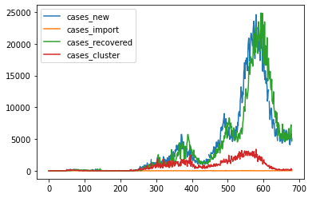
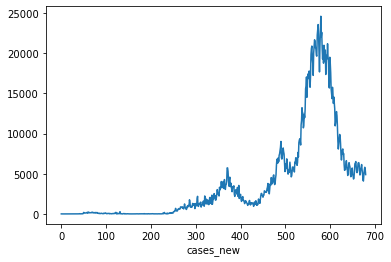
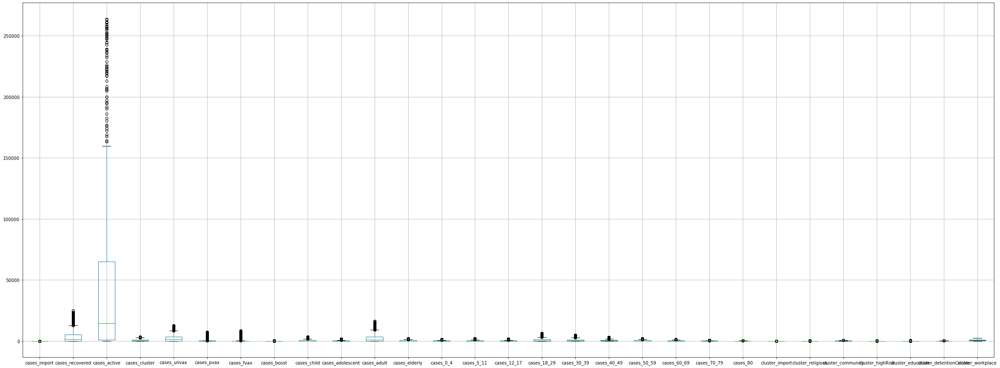
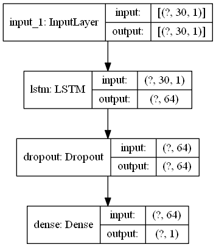
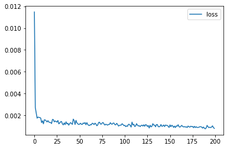
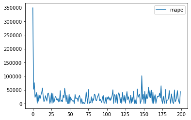
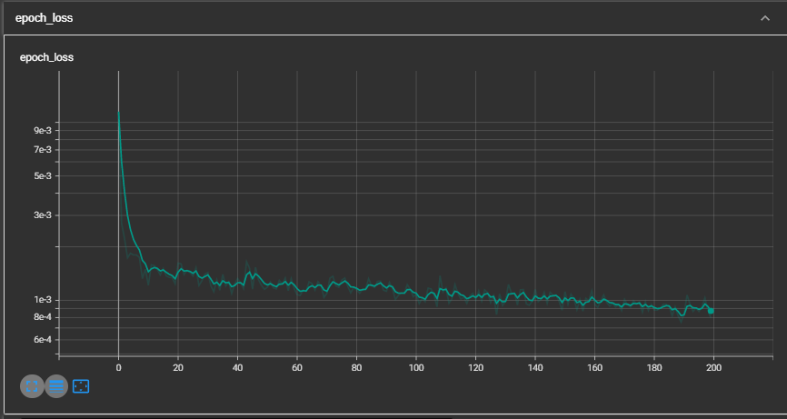
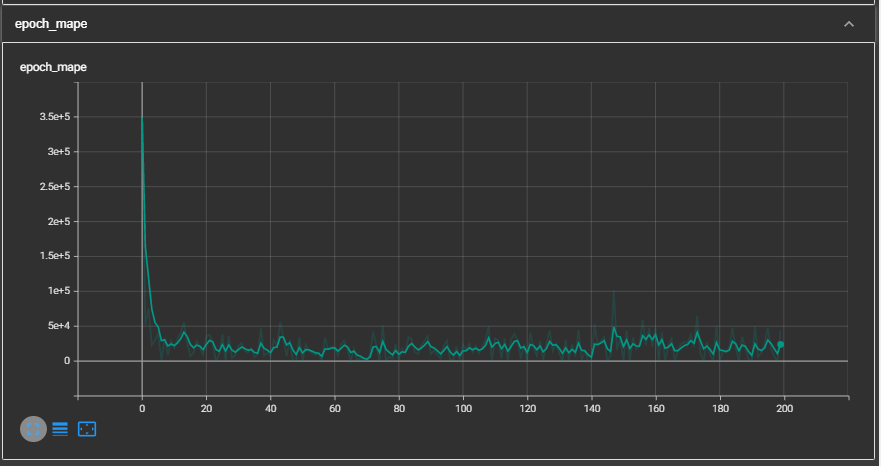
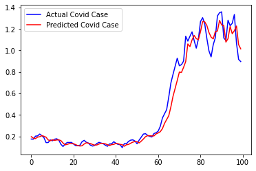
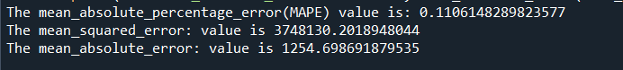

# Malaysia_Covid_Cases_Prediction
From Jan 2020 to December 2021, dataset of Covid-19 confirmed cases every day had contributed to prediction model for number of positive cases in the next run.

# Abstract
The year 2020 was a catastrophic year for humanity. Pneumonia of unknown aetiology was first reported in December 2019., since then, COVID-19 spread to the whole world and became a global pandemic. More than 200 countries were affected due to pandemic and many countries were trying to save precious lives of their people by imposing travel restrictions, quarantines, social distances, event postponements and lockdowns to prevent the spread of the virus. However, due to lackadaisical attitude, efforts attempted by the governments were jeopardised, thus, predisposing to the wide spread of virus and lost of lives.

# Objectives

To create a prediction number of new positive Covid-19 cases every day given trained with 679 days dataset.

# STEP 1 - Data Loading

Credit datasource from : 
Data is loaded as 'df' in this model.

## STEP 2 - Data Inspection

a. There are 30 columns in this data namely with 679 dataset made available:

['date', 'cases_new', 'cases_import', 'cases_recovered', 'cases_active',
         'cases_cluster', 'cases_unvax', 'cases_pvax', 'cases_fvax',
         'cases_boost', 'cases_child', 'cases_adolescent', 'cases_adult',
         'cases_elderly', 'cases_0_4', 'cases_5_11', 'cases_12_17',
         'cases_18_29', 'cases_30_39', 'cases_40_49', 'cases_50_59',
         'cases_60_69', 'cases_70_79', 'cases_80', 'cluster_import',
         'cluster_religious', 'cluster_community', 'cluster_highRisk',
         'cluster_education', 'cluster_detentionCentre', 'cluster_workplace']
         
         
b. Plot graphs

Visualisation for 'cases_new', 'cases_import', 'cases_recovered', 'cases_active' with graph plot



Visualisation on daily new cases graph




c. Check for missing datas/NaN values

There are 12 NaN values from 'cases_new' and
342 missing datas from cluster_import ,cluster_religious, cluster_community , cluster_education ,cluster_detentionCentre , cluster_workplace   
      
d. No duplicated data is present in this dataset

e. Check for outliers using boxplot


Cases new has shown a peak in values and causing outliers in this dataset, however the data remains during this model creation

# STEP 3 - Data Cleaning

a. Interpolate data to fill in NaN values
 
Cases_new data shows a degree 2 wave graph hence polynomial degree 2 is used to interpolate
` df['cases_new'].interpolate(method='polynomial', order=2, inplace=True) `

# STEP 4 - Features Selection

#Cases new will be the selected data for this model

# STEP 5 - Data Preprocessing

Min Max Scaling is used set a visualized range for output. By using window size = 30, every 30 days training will train the model for day 31st output.

# STEP 6 - Model Development
Training moodel is created using simple LSTM layer, single Input layer, single Output layer, and activation function = Relu.

```
model = Sequential()
model.add(Input(shape=(nb_features,1)))  #(30,1)
model.add(LSTM(num_node)) 
model.add(Dropout(drop_rate))
model.add(Dense(output_node,activation='relu')) 
model.summary()    
```
Show model architecture

`plot_model(model,show_layer_names=(True), show_shapes=(True))`



# STEP 7) MODEL ANALYSIS

a. Compile model 
Model is compiled using optimizer 'adam', loss = 'mse', and metrics = 'mape'

b. Callbacks
Tensorboard_callback is used and shown graph using log directory.

c. Fit the model created
Setting epochs = 300 and number nodes = 64, the data is set into fit and training into a new model.

d. Evaluate model loss and mape in graph plot

Model Loss graph



Model MAPE graph



Tensorboard Loss graph



Tensorboard MAPE graph



# STEP 8 - Model Evaluation

By using test set data, data is loaded as 'test_df'

Model is evaluated by using `model.predict`

# Plotting of evaluation graphs, Actual Covid Cases Vs Predicted Cases :



# MAPE value



# Step 9) Model Saving

Finally, Save Model path and scaler model pickle path

# Discussion)

The MAPE value achieved is 0.11 which is high in performance.

A simple LSTM, Dense, and Dropout layers is implemented in this model.

The MAPE loss can be further reduced in the future with some suggested approach:

    # 1) Increasing number of samples in the dataset
    
    # 2) Increasing the number of epochs
    
    # 3) Introduce different model architectures 

#A simple Long Short-Term Memory (LSTM) model is implemented with with an input layer, a single hidden (LSTM) layer, and an output layer 
that is used to make a prediction. The input layer has neurons equal to 30 sequence steps (for 30 days COVID-19 data points). 
The hidden layer is an LSTM layer with 64 hidden units (neurons) and a rectified linear unit (ReLU) as an activation function. 
The output layer had a dense layer with 1 unit for predicting the output. Moreover, we have set 300 as the number of epochs, Adam as the optimizer, 
and the mape as the loss function. After that, we fit the model with prepared data to make a prediction.
The obtained results may vary given the stochastic nature of the LSTM model; therefore, we have run it several times. 
Finally, we enter the last sequence with output to forecast the next value in the series.


